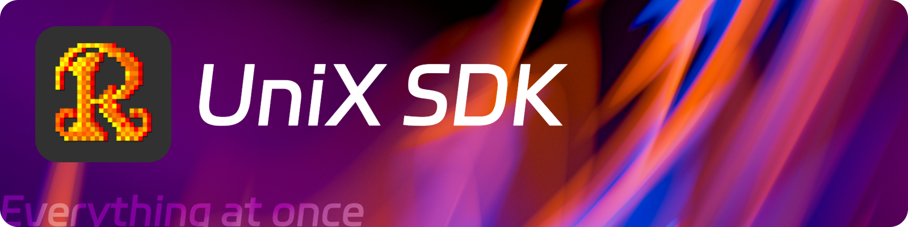

# UniX SDK

- 🪄 **为元梦之星Lua2.0开发**
- 📚 **包含常用功能封装**
- 📦 **模块化设计**
- 📦 **开箱即用**
- 🚀 **快速开发**

## 🚒 许可证

UniX SDK采用双重许可：

1. **Mozilla Public License 2.0 (MPL-2.0)**
   - 允许将SDK与专有代码结合使用
   - 对SDK的修改必须在相同许可下发布
   - 完整许可证文本请见[LICENSE](./LICENSE)文件

2. **归属要求**
   - 使用UniX SDK的应用必须显示"Powered by UniX SDK"
   - 具体要求请见[ATTRIBUTION.md](./docs/ATTRIBUTION.md)文件

## 🚀 快速开始

### 在Server目录中添加Unix SDK

> 下载SDK后在根目录下创建`Public`并在内创建`sdk`文件夹，将SDK文件放入其中

> 您也可以在[main.lua](./unix-sdk/main.lua)中修改SDK路径，同时请注意修改`Require`的路径

```lua
-- GameEntry.lua
-- 加载SDK全部功能
local UDK = require("Server.sdk.unix-sdk.main")

local Enum_Test_Array = {
    Test="Hello World!",
    Test1="UniX SDK is Awesome!",
    Foo="Foo",
    Bar="Bar"
    }
local Toml_Test_String = [[
[Info]
Name = "Toml Test"
]]

-- 定义Toml解析数据器
local Toml_Parse_Data = UDK.TomlUtils.Parse(Toml_Test_String)
-- 定义UDK.Array.ForKeyToValueRegX引用，如果需要匹配任何字符，请使用"."作为正则表达式
local UDK_Enum_RegX_Test_Array = UDK.Array.ForKeyToValueRegX(Enum_Test_Array, "Test")

-- 使用SDK打印枚举数组数据，输出结果为Hello World!
Log:PrintLog( UDK.Array.GetValueByEnum(Enum_Test_Array, "Test"))
-- 使用SDK正则获取数组内的数据，输出结果为Test*数据（Test/Test1）
for key, value in pairs (UDK_Enum_RegX_Test_Array) do
    Log:PrintLog(value)
end

-- Toml解析测试，输出结果为Toml Test
Log:PrintLog(Toml_Parse_Data.Info.Name)

-- 使用SDK设置原生界面可见性，输出结果为12个原生界面可见
UDK.UI.SetNativeInterfaceVisible({0,1,2,3,4,5,6,7,8,9,10,11}, true)
UDK.UI.SetNativeInterfaceVisible(
    { "Promotion", "Countdown", "TargetPoints", "CampPoints", "PersonalPoints", "Leaderboard", "HealthBar", "Settings",
        "RemainingPlayers", "MapHint", "EmotesAndActions", "QuickChat" }, true)
```

<!--
## 📦 模块

- [x] [UDK.Math](./utils/udk_math.lua)
- [x] [UDK.Array](./utils/udk_array.lua)
- [ ] [UDK.Animation](./ui/udk_animation.lua)
- [x] [UDK.Player](./utils/udk_player.lua)
- [x] [UDK.Storage](./utils/udk_storage.lua)
- [ ] [UDK.Logger](./utils/udk_logger.lua)
- [x] [UDK.UI](./ui/udk_ui.lua)
- [x] [UDK.Sound](./sound/udk_sound.lua)
- [x] [UDK.Libs.Toml](./utils/udk_toml.lua)
-->

## 🤝 贡献

欢迎贡献代码、报告问题或提出改进建议。请查阅[CONTRIBUTING.md](./docs/CONTRIBUTING.md)了解如何参与项目开发。

## 📄 归属声明

使用UniX SDK的应用程序必须在用户界面中显示"Powered by UniX SDK"，详细要求请参阅[ATTRIBUTION.md](./docs/ATTRIBUTION.md)。

---

2025 © [RoidMC Studios](https://www.roidmc.com) | [MPL-2.0 License](./LICENSE)